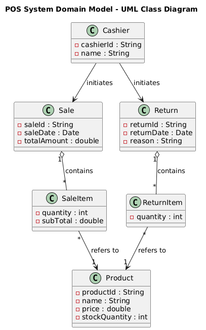
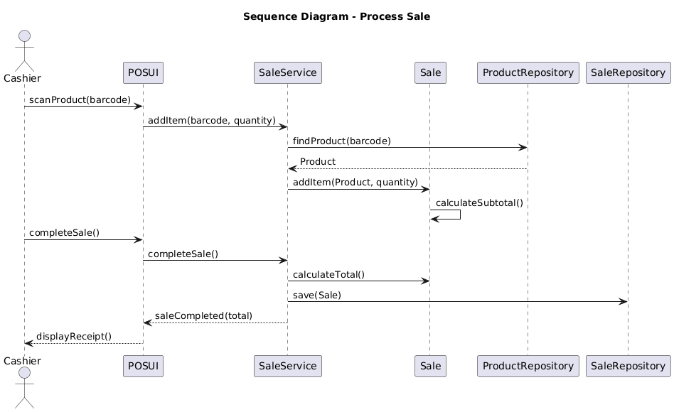

# Part 1: Agile Porject Management
**Project: Point-of-Sakle(POS) System**


## 1. Agile Project Management
This project adopts the **Agile software development methodology**, using the **Scrum framework** to manage the development of a small Point-of-Sale(POS) system. The system is developed iteratively and incrementally, allowing continuous feedback, collaboration, and improvement throughout the development lifecycle.

## 2. Scrum Framework<br>

**Sprint Duration**: 2 days<br>
**System Name:**
Small Supermarket Point-of-Sale(POS) System<br>

Tasks management and time arrangement<br>
**Core Function:**
1. Write user storys and correspond tasks
2. Arrange proporty time for each tasks

**As a Product Owner**, I want to clearly defined the project scope and objectives, so that the development team understands what should be delivered what is out of scope.<br>
**Task:**
1. Identify project goals and success criteria
2. Define system boundaries (what is included and excluded)
3. Write a short project scope description

**As a Product Owner**, I want to identify the core POS system features(sale processing and return handling), so that the team can focus on delivering the most valuable functionality first.
**Task:**
1. List all possible POS system functions
2. Identify core features (sale processing and return handling)

**As a team member**,I want to document system requirements in the form of user stories,
so that requirements are easy to understand, prioritize, and track.
**Task:**
1. Write user stories for each core feature
2. Ensure user stories follow the standard format
3. Review and refine user stories as a team

**As a Scrum Master**,
I want to break user stories into manageable tasks and estimate their effort,so that sprint planning can be carried out effectively.
**Task:**
1. Decide sprint length
2. Group tasks into Sprint 1 and Sprint 2


**Sprint Duration**: 2 days<br>
**System Name:**
Small Supermarket Point-of-Sale(POS) System<br>
**Core Function:**
1. Process Sale
2. Handle Returns

**As a cashier**, I want to scan items so that the system can calculate the total price.
**Tasks:**
1. Design item scanning workflow (input item ID / barcode) — 1 h

2. Implement item lookup and price retrieval — 2 h

3. Implement total price calculation logic — 1.5 h

4. Test item scanning and price calculation — 1 h

**As a cashier**, I want to view line-item details so that I can verify purchased items.
**Tasks:**
1. Design line-item data structure — 1 h

2. Implement display of line-item details — 2 h

3. Verify correctness of displayed items — 1 h

**As a cashier**, I want the system to update inventory after a sale.
**Tasks:**
1. Design inventory update logic — 1 h

2. Implement inventory deduction after sale — 2 h

3. Validate inventory consistency — 1 h

**As a cashier**, I want to generate a receipt so that customers can keep a record.
**Tasks:**

1. Design receipt format (items, total, date) — 1 h

2. Implement receipt generation logic — 2 h

3. Test receipt output — 1 h

**As a cashier**, I want to record returned items so that customers can get refunds.
**Tasks:**
1. Design return handling workflow — 1 h

2. Implement return transaction logic — 2 h

3. Implement refund calculation — 1 h

4. Test return process — 1 h

**As a user**, I want the system to store transaction records for future reference.
**Tasks:**

1. Design transaction record structure — 1 h

2. Implement transaction storage mechanism — 2 h

3. Validate stored transaction records — 1 h


# Part 2: POS System Design and Implementation

## 1. Project Introduction

This part of the project focuses on the analysis, design, and implementation of a Point-of-Sale (POS) system using object-oriented (OO) techniques. Building on the planning and Agile process established in Part 1, Part 2 translates the identified requirements into a concrete software design and working system.

The POS system is designed to support the core operations of a small supermarket, specifically processing product sales and handling product returns. Through this system, real-world business activities are modeled as software objects, such as products, sales transactions, and return records, allowing the system to be structured in a clear, modular, and extensible manner.

This part emphasizes the application of object-oriented analysis and design (OOA/OOD) methods. UML is used extensively to describe the system from multiple perspectives, including use case models, domain models, logical architecture, and interaction designs. These models help bridge the gap between system requirements and implementation, ensuring that the final system aligns with both functional needs and good software engineering practices.

In addition, this project is carried out collaboratively using GitHub, reinforcing practical experience with version control, branching, and team-based development. By completing this part of the project, students gain hands-on experience in transforming requirements into a well-structured object-oriented system, from design models to executable code and final presentation.

## 2. System function Requirement
The POS supermarket cashier information management system needs to support the following core function:
- Products Information management
- Products sales processing
- Products return processing
- Sales & Return record management
- Automatic inventory update

System design requirement:
1. Must use Object-oriented Thinking
2. Products, sales, returns must use Object-oriented model
3. Use UML to analysis and design the system

## 3. Use Case Diagram

**Use case model 1:**<br>
Prerequisite: Product must in system<br>
Participant: Cashier<br>
Process:
1. Scan the products
2. show Products information
3. Enter the number
4. Calculate the total price
5. Complete the payment

Postrequiste: Generate sale record, inventory decrease.<br>
Error: Product is not exist.

**Use case model 2:**
Prerequisite: Original sales record is exist<br>
Participant: Cashier<br>
Process:
1. Enter original record
2. Choose return Product
3. Verification information
4. Complete return processing

Postrequiste: Generate return record, Inventory increase.<br>
Error: The order does not exist or is expired.

## 4. The Domain Model
### 4.1. What is Domain Model

Domain Model is a conceptual abstraction of the real-world business domain, used to describe the Conceptual Classes, their key attributes, and the Associations between these objects within the business environment in which the system operates.

In the Object-Oriented Analysis(OOA) phase, the domain model：
- Does not concern itself with technical implementation.
- Does not include UI, database, or framework details
- Focus only on "What important things exist in business"

For POS system example, Domain model reflect the Description of Products, sales, return and the inter relationship with each other.

### 4.2. The key Objection and the corresponding element in Domain model

```
class Product{
    //Represents the products in the supermarket that can be sold or returned, which is the most basic and core business object in the system.

    int productId   // The only product identify
    string name     // The name of the product
    double price    
    stockQuantity   //current number in inventory
}
```

```
class sale{
    //Represents a complete sales transaction, recording the entire process of a customer purchasing goods.

    int saleId          //the indentify for each sale
    time saleDate       //the time of sale happened
    double totalAmount  //the total amount for the sale
}
```

```
class saleItem{
    //Represents a complete sales transaction, recording the entire process of a customer purchasing goods.

    int quantity    // the number for the sale products
    double subTotal // subtotal amount
}
```

```
class return{
    // Represents a return transaction, used to record the operation of a customer returning goods.

    int returnID    //The idenify for the return
    time returnDate // The time the return happen
    string reason   //The reason for return happened
}
```

```
class returnItem{
    // Description of the specific items and quantities returned in a particular return.

    int quantity    //The number for returned items
}
```

```
class cashier{
    \\ Represents the direct users of the system, responsible for executing sales and return operations

    int cashierId   //The identify for the cashier
    string name     //The name of the cashier

    function sale()
    function return()
}
```

### 4.3. The relationship between each objections
**4.3.1 Sale and SaleItme**

|Relation type |  Interprey |
|--------------|------------|
|relation| Aggregation|
|Multiple| 1 Sale contain multiple SaleItems|
|Business meaning| 1 Sale contain multiple products|

```
Sale 1 ----------* SaleItem
```
**4.3.2. SaleItem and Product**
|Relation type |  Interprey |
|--------------|------------|
|relation| Association|
|Multiple| 1 SaleItem correspond to 1 Product|
|Business meaning| Each sales detain correspond to specific product|
```
SaleItem *----------1 Product
```

**4.3.3. Return and ReturnItem**
|Relation type |  Interprey |
|--------------|------------|
|relation| Aggregation|
|Multiple| 1 Return contain multiple ReturnItems|

```
Return 1----------* ReturnItemsduct
```

**4.3.4. ReturnItem and Product**
|Relation type |  Interprey |
|--------------|------------|
|relation| Association|
|Multiple| 1 ReturnItem correspond 1 Product|

```
ReturnItem *----------1 Product
```

### 4.4. The relationship UML figure


## 5. Logical Architecture
### 5.1 Logical architecture overview
This POS supermarket cashier information management system adopts a hierarchical logical architecture

This architecture divides the system into multiple logical layers based on responsibilities, with each layer containing several functional modules. These layers interact through clear interfaces, thereby achieving:
- Separation of Concerns
- Low coupling, high cohesion
- Easy to maintain, easy to extend
- Support team collaboration development

The system is divided into **4 logical layer**:
1. Presentation Layer
2. Application Layer
3. Domain Layer
4. Persistence Layer

### 5.2 Presentation Layer
Presentation Layer is response for **User interaction**, including *Recive input from Cashier*, *display products, price and result of deal*, *exclude any business rules or business calculatiobns*.

This layer only response for **What to present** and **What to collect and input**.

This layer include functions:
|Model|Responsibility|
|--|--|
|POSUI|System main interface, corrdinating sales and return operations|
|SaleUI|  Product scanning, quantity input, settlement display|
|ReturnUI| Return item selection, return result display|

### 5.3. Application Layer
Application Layer is response for System's business coordinator, play a role for:
- Organize and coordinate business processes
- Control test case execution order
- Logical architecture overview
- Managme Business boundary

This Layer does not **store the business data itself**, nor is it responsible for UI display.

This layer include functions:
|Model|Responsibility|
|--|--|
|SaleService|Process the sales use case flow|
|ReturnService|Process return use case flow|
|InventoryService|Manage inventory change Logic|

### 5.4. Domain Layer
The domain layer is the system's* core business layer*, used to express:

- Real-world business concepts

- Core business rules

- Relationships between domain objects

This layer is the **most stable and most important layer** in the system.

This layer include functions:
|Model|Responsibility|
|--|--|
|Product|Indicate product and inventory information|
|Sale|To represent a single sales transaction|
|SaleItem|To represent sales details|
|Return|To represent Return transaction|
|ReturnItem|To represent Return details|
|Cashier|To represent System User|

### 5.5. Persistence Layer
The persistence layer is responsible for data storage and access, including:

- Product data persistence

- Sales and return record storage

- Masking underlying database details

This layer include functions:
|Model|Responsibility|
|--|--|
|ProductRepository|Product data access|
|SaleRepository|Sales records storage|
|ReturnRepository|Return record storage|

### 5.6. The POS logical archtecture UML figure


## 6. OO design
### 6.1. Product Sale Sequence Diagram


### 6.2. Store retrun Sequence Diagram


### 6.3. Design Class Diagram
The OO design of the POS system is represented using UML interaction and class diagrams.
The sequence diagrams illustrate how UI, service, domain, and repository objects collaborate to realize the sale and return use cases.
The design class diagram defines software-level classes, their attributes, operations, and dependencies, ensuring a clear separation of concerns and adherence to object-oriented principles.


## 7. Implementation

### 7.1. Domain Layer
**Product.jave**
```
package domain;

public class Product {
    private String productId;
    private String name;
    private double price;
    private int stockQuantity;

    public Product(String productId, String name, double price, int stockQuantity) {
        this.productId = productId;
        this.name = name;
        this.price = price;
        this.stockQuantity = stockQuantity;
    }

    public String getProductId() {
        return productId;
    }

    public double getPrice() {
        return price;
    }

    public int getStockQuantity() {
        return stockQuantity;
    }

    public void reduceStock(int qty) {
        stockQuantity -= qty;
    }

    public void increaseStock(int qty) {
        stockQuantity += qty;
    }

    @Override
    public String toString() {
        return productId + " | " + name + " | $" + price + " | Stock: " + stockQuantity;
    }
}
```

**SaleItem.jave**:
```
package domain;

public class SaleItem {
    private Product product;
    private int quantity;

    public SaleItem(Product product, int quantity) {
        this.product = product;
        this.quantity = quantity;
    }

    public double getSubtotal() {
        return product.getPrice() * quantity;
    }

    public Product getProduct() {
        return product;
    }

    public int getQuantity() {
        return quantity;
    }
}
```

**Sale.jave**:
```
package domain;

import java.util.ArrayList;
import java.util.List;

public class Sale {
    private List<SaleItem> items = new ArrayList<>();

    public void addItem(Product product, int quantity) {
        items.add(new SaleItem(product, quantity));
        product.reduceStock(quantity);
    }

    public double calculateTotal() {
        double total = 0;
        for (SaleItem item : items) {
            total += item.getSubtotal();
        }
        return total;
    }

    public List<SaleItem> getItems() {
        return items;
    }
}
```

**ReturnItem.java**:
```
package domain;

public class ReturnItem {
    private Product product;
    private int quantity;

    public ReturnItem(Product product, int quantity) {
        this.product = product;
        this.quantity = quantity;
    }

    public void processReturn() {
        product.increaseStock(quantity);
    }
}
```

**Return.java**:
```
package domain;

import java.util.ArrayList;
import java.util.List;

public class Return {
    private List<ReturnItem> items = new ArrayList<>();

    public void addReturnItem(Product product, int quantity) {
        ReturnItem item = new ReturnItem(product, quantity);
        item.processReturn();
        items.add(item);
    }
}
```

### 7.2. Repository Layer
**ProductRepository.java**:
```
package repository;

import domain.Product;
import java.util.HashMap;
import java.util.Map;

public class ProductRepository {
    private Map<String, Product> products = new HashMap<>();

    public ProductRepository() {
        products.put("P001", new Product("P001", "Milk", 2.5, 50));
        products.put("P002", new Product("P002", "Bread", 1.8, 30));
        products.put("P003", new Product("P003", "Apple", 0.5, 100));
    }

    public Product findProduct(String id) {
        return products.get(id);
    }

    public void showAllProducts() {
        products.values().forEach(System.out::println);
    }
}
```

**SaleRepository.java**:
```
package repository;

import domain.Sale;
import java.util.ArrayList;
import java.util.List;

public class SaleRepository {
    private List<Sale> sales = new ArrayList<>();

    public void save(Sale sale) {
        sales.add(sale);
    }
}
```

**ReturnRepository.java**:
```
package repository;

import domain.Return;
import java.util.ArrayList;
import java.util.List;

public class ReturnRepository {
    private List<Return> returns = new ArrayList<>();

    public void save(Return r) {
        returns.add(r);
    }
}
```

### 7.3. Service Layer
**SaleService.java**:
```
package service;

import domain.Product;
import domain.Sale;
import repository.ProductRepository;
import repository.SaleRepository;

public class SaleService {
    private Sale sale = new Sale();
    private ProductRepository productRepo;
    private SaleRepository saleRepo;

    public SaleService(ProductRepository productRepo, SaleRepository saleRepo) {
        this.productRepo = productRepo;
        this.saleRepo = saleRepo;
    }

    public void addItem(String productId, int quantity) {
        Product product = productRepo.findProduct(productId);
        if (product == null || product.getStockQuantity() < quantity) {
            throw new IllegalArgumentException("Invalid product or insufficient stock");
        }
        sale.addItem(product, quantity);
    }

    public double completeSale() {
        double total = sale.calculateTotal();
        saleRepo.save(sale);
        return total;
    }
}
```

**ReturnService.java**
```
package service;

import domain.Product;
import domain.Return;
import repository.ProductRepository;
import repository.ReturnRepository;

public class ReturnService {
    private ProductRepository productRepo;
    private ReturnRepository returnRepo;

    public ReturnService(ProductRepository productRepo, ReturnRepository returnRepo) {
        this.productRepo = productRepo;
        this.returnRepo = returnRepo;
    }

    public void processReturn(String productId, int quantity) {
        Product product = productRepo.findProduct(productId);
        if (product == null) {
            throw new IllegalArgumentException("Invalid product");
        }
        Return r = new Return();
        r.addReturnItem(product, quantity);
        returnRepo.save(r);
    }
}
```

### 7.4. UI Layer
**POSUI.java**:
```
package ui;

import repository.*;
import service.*;

import java.util.Scanner;

public class POSUI {
    private ProductRepository productRepo = new ProductRepository();
    private SaleRepository saleRepo = new SaleRepository();
    private ReturnRepository returnRepo = new ReturnRepository();

    public void start() {
        Scanner scanner = new Scanner(System.in);
        boolean running = true;

        while (running) {
            System.out.println("\n1. Process Sale");
            System.out.println("2. Handle Return");
            System.out.println("3. Show Products");
            System.out.println("0. Exit");
            System.out.print("Choose: ");

            int choice = scanner.nextInt();

            try {
                switch (choice) {
                    case 1 -> processSale(scanner);
                    case 2 -> processReturn(scanner);
                    case 3 -> productRepo.showAllProducts();
                    case 0 -> running = false;
                }
            } catch (Exception e) {
                System.out.println("Error: " + e.getMessage());
            }
        }
    }

    private void processSale(Scanner scanner) {
        SaleService service = new SaleService(productRepo, saleRepo);
        while (true) {
            System.out.print("Enter Product ID (or 0 to finish): ");
            String id = scanner.next();
            if (id.equals("0")) break;

            System.out.print("Quantity: ");
            int qty = scanner.nextInt();
            service.addItem(id, qty);
        }
        double total = service.completeSale();
        System.out.println("Sale completed. Total: $" + total);
    }

    private void processReturn(Scanner scanner) {
        ReturnService service = new ReturnService(productRepo, returnRepo);
        System.out.print("Enter Product ID: ");
        String id = scanner.next();

        System.out.print("Quantity: ");
        int qty = scanner.nextInt();

        service.processReturn(id, qty);
        System.out.println("Return processed successfully.");
    }
}
```

### 7.5. System entrance
**Main.java**:
```
import ui.POSUI;

public class Main {
    public static void main(String[] args) {
        new POSUI().start();
    }
}
```
